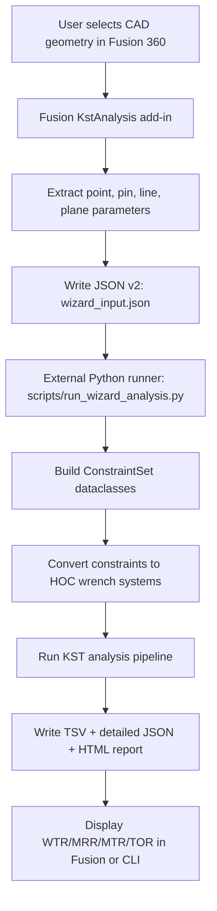
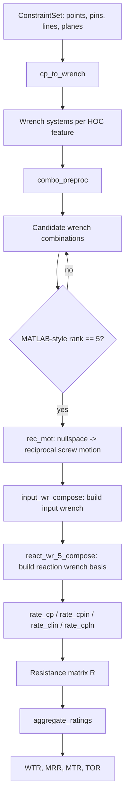
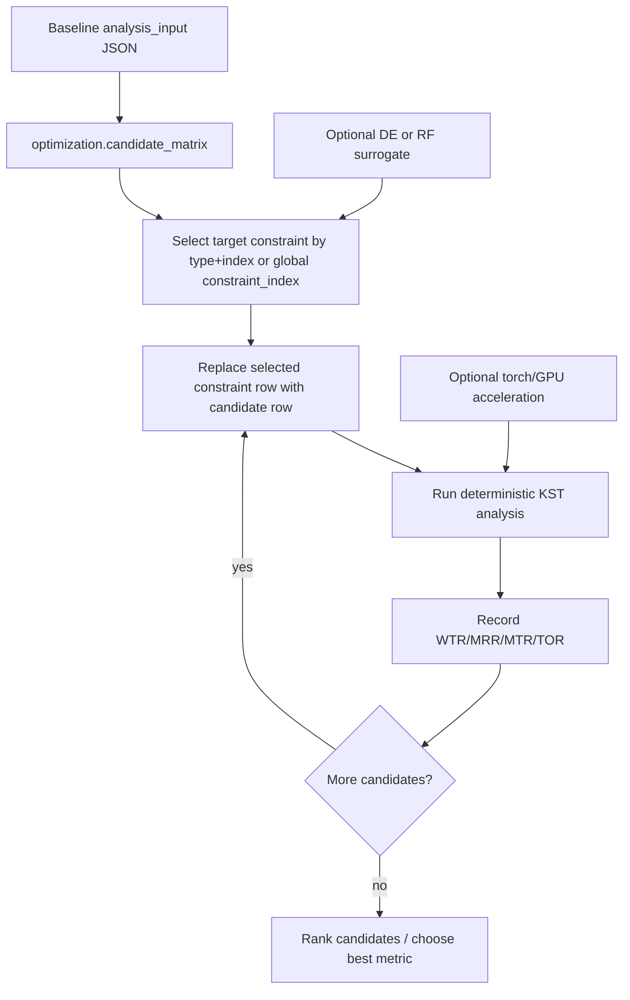
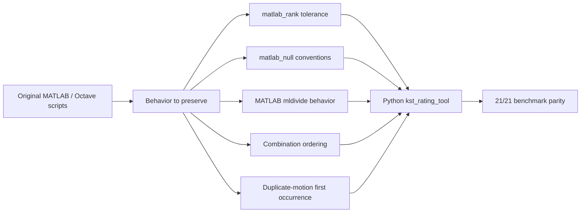

# Colloquium Program Flowchart

Yes, this is useful to include, but preferably as a backup or compressed slide. It helps answer:

- How does CAD geometry become KST math data?
- Where does the MATLAB-to-Python parity layer sit?
- Where does optimization enter the program?
- Which part is deterministic physics and which part is search/acceleration?

## High-Level System Flow



Slide note:

> The Fusion add-in is a geometry preprocessor. The mathematical analysis happens in external Python so the solver can use NumPy/SciPy and remain reusable by other CAD hosts.

## Core KST Engine Flow



Slide note:

> The rank-5 step matters because in a 6D screw space, a rank-5 wrench set leaves one reciprocal screw motion. That remaining motion is the one being rated.

## Optimization Flow



Slide note:

> The optimizer changes the candidate constraint rows, but the score is still produced by the same deterministic KST engine. Random Forest and Differential Evolution are search helpers, not replacements for the physical model.

## MATLAB-to-Python Parity Layer



Slide note:

> This explains why the first implementation phase prioritized one-to-one behavior. It protects the CAD and optimization phases from being built on a drifting math engine.

## Suggested Placement In The 10-Minute Presentation

Best option:

- Keep the main deck as-is, but use the high-level system flow as a backup slide after "Current Status".

If Dr. Eka pushes on math:

- Show the "Core KST Engine Flow".

If the question is about optimization:

- Show the "Optimization Flow".

If the question is about why Python matches MATLAB:

- Show the "MATLAB-to-Python Parity Layer".

## One-Screen ASCII Fallback

Use this if Mermaid is not supported by the slide renderer:

```text
Fusion CAD pick
   -> JSON v2 rows
   -> ConstraintSet
   -> HOC wrench systems
   -> rank-5 combinations
   -> nullspace reciprocal screw motion
   -> reaction solve
   -> resistance matrix R
   -> WTR/MRR/MTR/TOR
   -> report / optimization ranking
```
